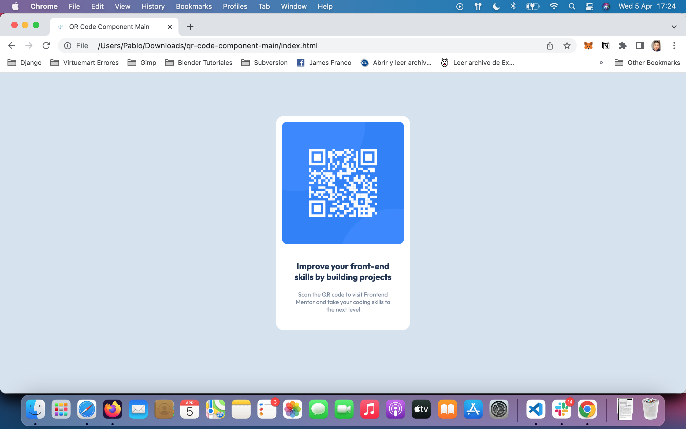
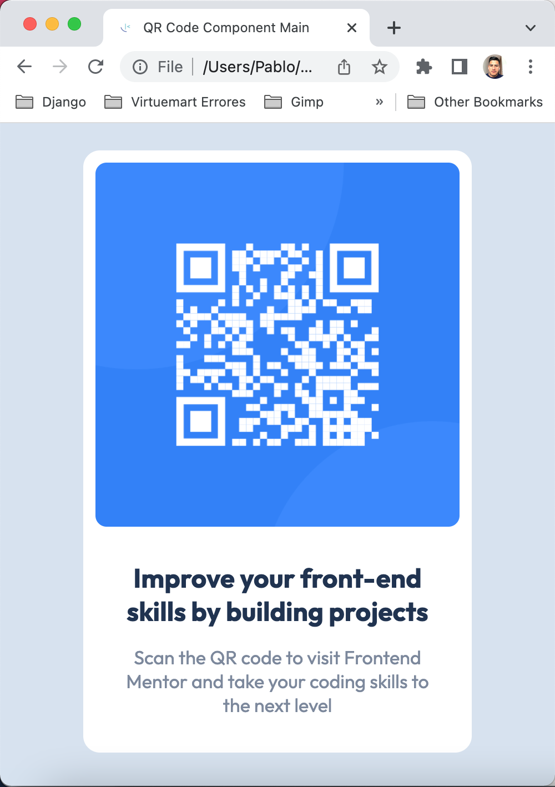

# Frontend Mentor - QR code component solution

This is a solution to the [QR code component challenge on Frontend Mentor](https://www.frontendmentor.io/challenges/qr-code-component-iux_sIO_H). Frontend Mentor challenges help you improve your coding skills by building realistic projects. 

## Table of contents

- [Overview](#overview)
  - [Screenshot](#screenshot)
  - [Links](#links)
- [My process](#my-process)
  - [What I learned](#what-i-learned)
- [Author](#author)

**Note: Delete this note and update the table of contents based on what sections you keep.**

## Overview
This is the most basic project from Frontend Mentor called QR code component. This is a beginner project to practice HTML and CSS to show a QR code card.

### Screenshot





### Links

- Solution URL: [https://github.com/paalvarador/qr-code-component-main.git](https://github.com/paalvarador/qr-code-component-main.git)
- Live Site URL: [https://paalvarador.github.io/qr-code-component-main/](https://paalvarador.github.io/qr-code-component-main/)

## My process

### Built with

- HTML5
- CSS custom properties
- CSS variables
- Responsive
- [Google Fonts](https://fonts.googleapis.com/css2?family=Outfit:wght@400;700&family=Roboto:wght@400;500;700&display=swap) - Google Fonts


### What I learned

I've learned how to display components with html and css without flex or grid display box. I use css variables to reuse those on all of the style sheet

```css
:root {
  /* Colors */
    --white: hsl(0, 0%, 100%);
    --lightgray: hsl(212, 45%, 89%);
    --grayishblue: hsl(220, 15%, 55%);
    --darkblue: hsl(218, 44%, 22%);

    /* Fonts */
    --body-font-size: 15px;
    --body-font-weight-400: 400;
    --body-font-weight-700: 700;
}
```
## Author

- Website - [https://paalvarador.github.io/qr-code-component-main/](https://paalvarador.github.io/qr-code-component-main/)
- Frontend Mentor - [@paalvarador](https://www.frontendmentor.io/profile/paalvarador)
- Twitter - [@paalvarador](https://www.twitter.com/paalvarador)

